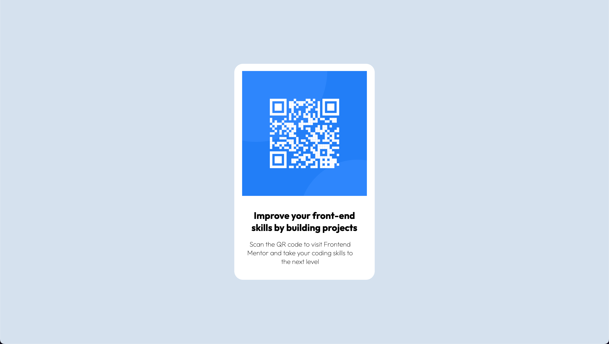

# Frontend Mentor - QR code component solution

This is a solution to the [QR code component challenge on Frontend Mentor](https://www.frontendmentor.io/challenges/qr-code-component-iux_sIO_H). Frontend Mentor challenges help you improve your coding skills by building realistic projects.

## Table of contents

- [Overview](#overview)
  - [Screenshot](#screenshot)
  - [Links](#links)
- [My process](#my-process)
  - [Built with](#built-with)
  - [What I learned](#what-i-learned)

## Overview

### Screenshot

#### Desktop View:



#### Mobile View:


### Links

[Live Demo](https://jerryren527.github.io/qr-code-component-react/){target="_blank" rel="noopener noreferrer"}

[Custom Figma File](https://www.figma.com/file/WgcYUgKCizbC6C0d2ZgVV9/qr-code-component?node-id=0%3A1&t=PMYKcSw5N58Evi3D-1){target="_blank" rel="noopener noreferrer"}

## My process

### Built with

- HTML
- CSS
- JavaScript
- React

### What I learned

To center a block element:

```css
.card-title {
  width: 329px;
  margin-left: auto;
  margin-right: auto;
}
```
